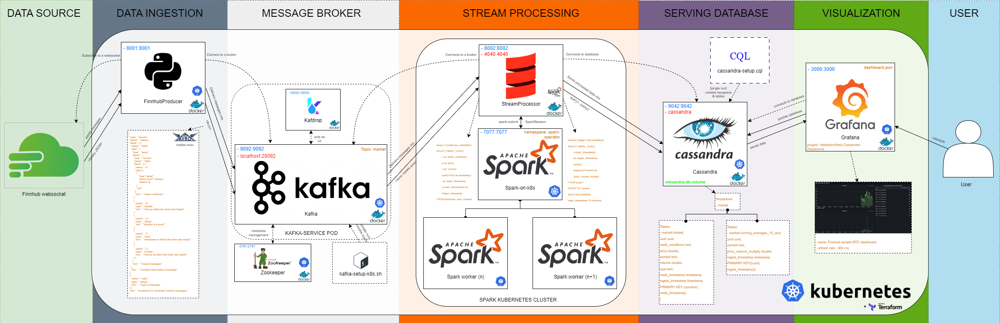
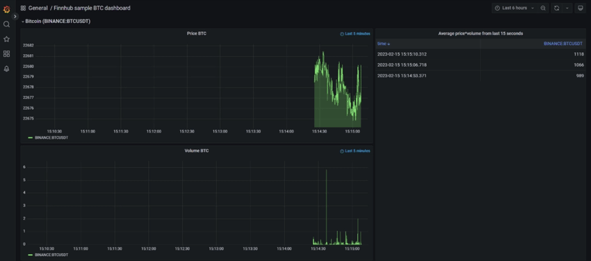

# Real-Time Stock Streaming Data Pipeline

## Description

The Real-Time Stock Streaming Data Pipeline is a comprehensive project designed for my master's thesis, focusing on stream processing. It leverages Finnhub.io API/websocket for real-time trading data, providing a showcase of key aspects in streaming pipeline development and architecture. The goal is to achieve low latency, scalability, and availability.


## Requirements

- Docker
- Kubernetes
- Terraform
- Finnhub API Token

## Getting Started

1. Clone the repository:
    ```bash
    git clone https://github.com/Mohamed-Ahmed-Ali/Real-Time-Stock-Streaming-Data-Pipeline.git
    cd Real-Time-Stock-Streaming-Data-Pipeline
    ```

2. Set up your Finnhub API token in the `terraform-k8s/config.tf` file.

3. Follow the [Setup & Deployment](#setup--deployment) section for local Minikube deployment.

## Technology Stack
- Docker
- Kubernetes
- Terraform
- Apache Kafka
- Apache Spark
- Apache Cassandra
- Grafana

## Data Source
Finnhub.io

## Architecture



The diagram illustrates the detailed architecture of the pipeline. All applications are containerized using Docker and orchestrated by Kubernetes, with infrastructure management handled by Terraform.

**Data Ingestion Layer:**
- **FinnhubProducer:** A containerized Python application that connects to the Finnhub.io websocket, encodes messages into Avro format, and ingests them into the Kafka broker.

**Message Broker Layer:**
- **Kafka:** Consumes messages from FinnhubProducer. The Kafka broker resides in the kafka-service pod, accompanied by Kafdrop service as a sidecar ambassador container. The kafka-setup-k8s.sh script creates topics. Zookeeper pod is launched before Kafka for metadata management.

**Stream Processing Layer:**
- **Spark Kubernetes Cluster:** Deployed using Helm, based on spark-k8s-operator. A Scala application, StreamProcessor, is submitted to the Spark cluster manager. It connects to the Kafka broker, retrieves messages, transforms them using Spark Structured Streaming, and loads them into Cassandra tables. The first query, transforming trades, runs continuously, while the second, with aggregations, triggers every 5 seconds.

**Serving Database Layer:**
- **Cassandra:** Stores and persists data from Spark jobs. The cassandra-setup.cql script runs upon launch to create the keyspace and tables.

**Visualization Layer:**
- **Grafana:** Connects to the Cassandra database using HadesArchitect-Cassandra-Plugin and serves visualized data to users through the example Finnhub Sample BTC Dashboard. The dashboard refreshes every 500ms.

## Data Modeling
Data modeling is performed using Avro format for message encoding and Apache Cassandra for data storage. The Avro schema ensures a consistent data structure, while Cassandra tables are designed to efficiently store and query real-time stock data.

## Dashboard



Access Grafana with the dashboard on localhost:3000 by running the following command:

```bash
kubectl port-forward -n pipeline service/grafana 3000:3000
```

## Setup & deployment

The application is designed to be deployed on a local Minikube cluster. However, the deployment into EKS/GKE/AKS should be quite straight-forward, with tweaking deployment settings for providers, volumes etc.

Running the application requires you to have a Finnhub API token. You can retrieve it once you have created a Finnhub account. To include it in final deployment, insert it into proper fields in terraform-k8s/config.tf, along with Cassandra database username & password of choice. While setting Cassandra credentials remember to verify them with Grafana dashboard settings (the issue is referenced in config.tf file).

There is also an old setup that relies solely on docker-compose. To reach that, navigate to the docker-compose-old branch.

I was running this cluster on Windows with Minikube, Helm, Docker Desktop and Terraform pre-installed. I have utilized local Docker registry to apply custom images into deployment. I was launching it with no vtx enabled, using VirtualBox as VM engine. Below attached are scripts that I was running in Powershell in order to run the cluster as intended:

```
set HTTP_PROXY=http://<proxy hostname:port>
set HTTPS_PROXY=https://<proxy hostname:port>
set NO_PROXY=localhost,127.0.0.1,10.96.0.0/12,192.168.59.0/24,192.168.49.0/24,192.168.39.0/24

minikube start --no-vtx-check --memory 10240 --cpus 6

minikube docker-env
set DOCKER_TLS_VERIFY=”1"
set DOCKER_HOST=”tcp://172.17.0.2:2376"
set DOCKER_CERT_PATH=”/home/user/.minikube/certs”
set MINIKUBE_ACTIVE_DOCKERD=”minikube”

minikube docker-env | Invoke-Expression

docker-compose -f docker-compose-ci.yaml build --no-cache

cd terraform-k8s
terraform apply
```

## Potential improvements

There is definitely some room for improvement for the pipeline. The solution itself has some issues at the moment and there are some ideas that would enable its full potential in production:

- November 2023 update: deleted SparkOperator image

It seems that the SparkOperator image from Google Container Registry is deleted, therefore the pipeline will fail to build. If you would like to run the pipeline on your own, you will need to replace the Spark image first and possibly alter some configuration settings.

- Cloud deployment

The pipeline was developed locally on Minikube, but deploying it into one of Kubernetes services of major cloud vendors would massively improve its scalability & reliability. This would be a must-have in real-life commercialized deployment.

- Developing CI/CD pipeline

The current CI_build.yml file for Github Actions is a remnant of old docker-compose version and setting up CI for Kubernetes & Terraform, along with pipeline testing, would require much more work, which was not necessary for me as I was developing & testing everything locally. However, it would be essential to implement that on a larger scale deployment, along with adding CD for cloud deployment.

- Visualization tool

Although I have used Grafana for final visualization layer, I would look forward to spend more time implementing other solution as Grafana, especially while using external plugin, has limited capabilities for data analytics. Personally I would recommend to go with open-source BI solution, such as Apache Superset, and spin Cassandra into Presto engine, or develop custom Streamlit app.

- Cassandra initial startup fix

At initial Kubernetes deployment, Cassandra deployment might fail once or twice with PostHookStartErrors. It is most likely related to its gossiping protocol at the startup, and lifecycle->postStart command runs too early. Extending sleep time in postStart command would help to address that, but it would extend startup times later on. Implementing readiness/liveness probe might be helpful for that.

- Deploying Cassandra & Kafka as StatefulSets

Right now, Cassandra & Kafka are configured to be standard deployments. However, implementing them as StatefulSets would be desired in order to improve their scalability and reliability at scale.

- adding Cassandra Web UI as ambassador

Adding some sort of Cassandra Web UI as a sidebar ambassador container to Cassandra deployment would be helpful for operations & log analytics.

- volumeMounts instead of Dockerfiles

For some features, for example Grafana dashboards or Kafka setup script, volumeMounts would be more convenient rather than copying content into Docker image, as it wouldn't enforce rebuilding it.

- code cleanup & further development

There is room to develop more advanced codebase into a project, for example to implement Lambda architecture & batch processing for some use cases, or improve Kubernetes deployment configuration. Some code for applications might also be cleaned up and/or optimized (for example for build.sbt).

## Contributing
If you'd like to contribute to the project, please follow the standard GitHub flow:
1. Fork the repository.
2. Create a new branch for your feature or bug fix.
3. Make your changes and submit a pull request.
